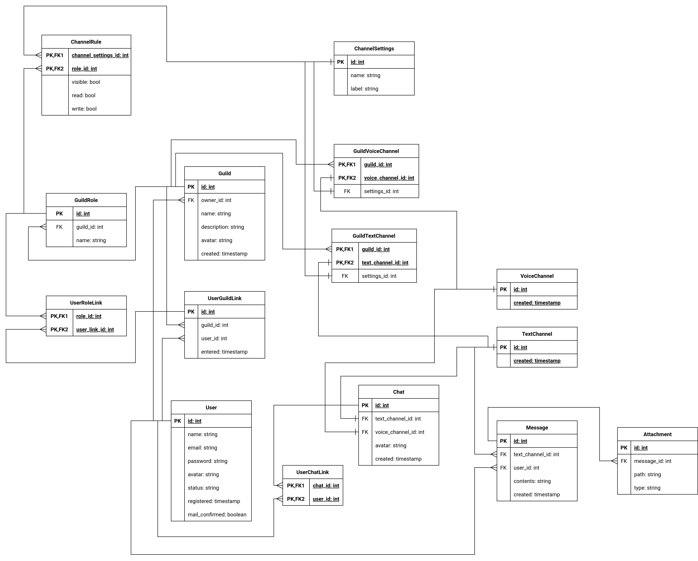

# Discord

## 1. Тема и целевая аудитория

### Ключевой функционал
- Логин/Регистрация
- Личные и групповые голосовые чаты
- Отправка сообщений с вложениями
- "Сервера" с несколькими голосовыми и текстовыми каналами

### Целевая аудитория
150 млн пользователей в месяц по всему миру  
- Северная Америка - 30% 
- Европа - 15%  
- Южная Америка - 12%

Остальное распределено по миру.

## 2. Расчет нагрузки

### Продуктовые метрики

| Метрика                                      | Значение |
| -------------------------------------------- | -------- |
| Зарегистрированных пользователей             | 500 млн  |
| Месячная аудитория                           | 150 млн  |
| Суточная аудитория                           | 20 млн   |
| Максимальное количество пользователей онлайн | 10 млн   |
| Минут голосового общения в день              | 4 млрд   |
| Сообщений в день                             | 4 млрд   |
| "Серверов" и групповых чатов                 | 25 млн   |

### Количество операций по типам

Количество сообщений на пользователя в день - `4 млрд / 20 млн = 200`  
Будем считать, что 5% отправляемых пользователем сообщений имеют вложения

Считаем, что пользователь меняет свою аватарку/аватарку сервера раз в две недели

| Операция                         | Среднее кол-во в день на пользователя |
| -------------------------------- | :-----------------------------------: |
| Аутентификация                   |                   2                   |
| Смена аватара                    |                 0.07                  |
| Вход в голосовой чат/канал       |                  15                   |
| Получение списка участников чата |                  40                   |
| Получение списка сообщений чата  |                  40                   |
| Получение списка чатов           |                  20                   |
| Отправка сообщения               |                  200                  |
| Отправка вложения                |                  10                   |

### Технические метрики

#### Хранилище

Хранилище требуется для пользовательских данных, данных серверов/чатов и хранения сообщений.    
Данными серверов/чатов и пользователей, кроме аватаров можно принебречь.
Размер аватара в среднем равен 2 Кб (отображаются в клиенте максимум размером 96*96)  

Имеем:  
`2 Кб * (500 млн + 25 млн) = 1 Тб` 

Среднюю длину сообщения, отправленного пользователем, будем считать равным 100 символов,
а размер символа - 2 байтам. Т.е. средний размер сообщения - 200 байт.

Средний размер вложения считаем равным 1 Мб.  
Будем считать, что 5% отправляемых пользователем сообщений имеют вложения

Discord хранит около 4 триллионов сообщений, для их хранения потребуется:  
`4e12 * (200 + 0.05 * 1000) / 1e12 = 1000 Тб`

| Тип данных | Размер  |
| ---------- | ------- |
| Аватары    | 1 Тб    |
| Сообщения  | 1000 Тб |
 
#### RPS

Учитывая 20 млн DAU и 10 млн пиковый онлайн:  
Считаем средний RPS по формуле: `20 млн * N / 24 / 3600`, где N - число операций определённого типа в день  
Считаем пиковый RPS, как 2 * средний RPS

| Операция                         | Средний RPS | Пиковый RPS |
| -------------------------------- | :---------: | :---------: |
| Аутентификация                   |     463     |     926     |
| Смена аватара                    |     16      |     32      |
| Вход в голосовой чат/канал       |    3471     |    6942     |
| Получение списка участников чата |    9256     |   18 512    |
| Получение списка сообщений чата  |    9256     |   18 512    |
| Получение списка чатов           |    4628     |    9256     |
| Отправка сообщения               |   46 296    |   92 592    |
| Отправка вложения                |    2314     |    4628     |
| **Сумма**                        | **75 700**  | **151 400** |

#### Сетевой трафик

**Голосовые чаты**

Пусть битрейт звука в голосовых чатах - 96 кбит/с  

Учитывая 4 млрд минут голосового общения в день, суммарный суточный трафик для голосовых чатов:  
`4 млрд * 60 с * 96 кбит/с = 23 040 000 Гбит/сутки = 23 040 000 * 0.116 = 2 672 640 Гбайт/сутки`

Учитывая 20 млн DAU, среднее потребление трафика для голосовых чатов в секунду:  
`23 040 000 Гбит/сутки / 24 / 3600 = 266.7 Гбит/c`

Пиковое потребление трафика считаем равным 2 * среднее:
`2 * 266.7 = 533.4 Гбит/c`

Для голосовых чатов исходящий трафик равен входящему, т.к. входящие голосовые потоки микшируются на сервере в 1 исходящий.

**Смена аватара**  
Относится к входящему трафику, средний размер аватара при отправке считаем равным 500 Кб.

**Получение списка сообщений**  
Относится к исходящему трафику  
Считаем, что на каждый запрос пользователь получает последние 15 сообщений,
при среднем размере в 200 байт и среднем размере вложения в 1 Мб на один запрос имеем:  
`15 * (200 + 0.05 * 1e6) = 0.753 Мб`

**Получение списка чатов**  
Относится к исходящему трафику  
Считаем, что на каждый запрос пользователь получает информацию о 20 чатах/"серверах",
при среднем размере аватара в 2 Кб имеем:
`20 * 2 = 40 Кб`

Получение списка участников чата считаем аналогично.

**Отправка сообщения/вложения**  
При получении сообщения от пользователя его надо отправить, в среднем, 5 другим пользователям  
Таким образом, исходящий трафик в 5 раз больше входящего

**Входящий трафик**
| Операция           | Средний трафик, Гбит/с | Пиковый трафик, Гбит/с | Суточный трафик, Гбайт |
| ------------------ | :--------------------: | :--------------------: | :--------------------: |
| Голосовой чат      |         266.7          |         533.4          |       2 672 640        |
| Смена аватара      |          0.06          |          0.12          |          648           |
| Отправка сообщения |          0.07          |          0.14          |          756           |
| Отправка вложения  |           18           |           36           |        194 400         |
| **Сумма**          |       **284.83**       |       **569.66**       |     **2 868 444**      |

**Исходящий трафик**
| Операция                         | Средний трафик, Гбит/с | Пиковый трафик, Гбит/с | Суточный трафик, Гбайт |
| -------------------------------- | :--------------------: | :--------------------: | :--------------------: |
| Голосовой чат                    |         266.7          |         533.4          |       2 672 640        |
| Получение списка участников чата |           3            |           6            |         32 400         |
| Получение списка сообщений чата  |          55.8          |         111.6          |        602 640         |
| Получение списка чатов           |          1.5           |           3            |         16 200         |
| Отправка сообщения               |          0.35          |          0.7           |         3 780          |
| Отправка вложения                |           90           |          180           |        972 000         |
| **Сумма**                        |       **417.35**       |       **834.7**        |     **4 299 660**      |

## 3. Глобальная балансировка нагрузки

### Физическое расположение датацентров

| Регион           | Процент трафика | Процент датацентров |
| ---------------- | :-------------: | :-----------------: |
| Северная Америка |       35        |         50          |
| Европа           |       25        |         30          |
| Азия             |       15        |         20          |

В каждом регионе предлагаю распределить датацентры относительно плотности пользователей, учитывая:

1. В США 30% трафика => большинство датацентров Северной Америки расположим там
2. Discord заблокирован в Китае => не учитываем при распределении датацентров по Азии

### Схема балансировки

1. Определяем регион через Geo-based DNS
2. В рамках региона выбираем датацентр через BGP Anycast

В сервера голосовых чатов клиент ходит напрямую, по адресу, возвращаемому основным датацентром.

## 4. Локальная балансировка нагрузки

### Нагрузка по SSL

Сначала рассмотрим нагрузку обычных HTTPS запросов (не WebRTC)  
Используя бенчмарки nginx, рассчитаем необходимое количество ядер для машин с nginx

Пиковый RPS равен 151 400, суммарный пиковый трафик - 337.56 Гбит/с  
Пусть на датацентр приходится в среднем 10% запросов/трафика, тогда на один ДЦ приходится:

151 400 * 0.1 = 15 140 RPS    
337.56  * 0.1 = 33.76 Гбит/с

Исходя из бенчмарка nginx, 4 ядер на датацентр хватит.  

### Схема балансировки

1. На входе в ДЦ ставим 2 роутера
2. Далее трафик проксируется на 2 4-ядерные машины с nginx через BGP
3. nginx балансирует трафик на application-сервера по round-robin стратегии

В случае голосовых чатов пользователи подключаются к серверам напрямую, через WebRTC.  
Адрес сервера пользователи получают следующим образом:  
- Если это первый участник чата:  
Выбираем наименее загруженный сервер в регионе с помощью service discovery, прикрепляем его адрес к чату, возвращаем адрес пользователю

- Если чат уже активен:  
Возвращаем пользователю адрес сервера, к которому привязан чат

Отказоустойчивость будет обеспечиваться следующим образом:
1. Два роутера на входе в ДЦ
2. Две машины с nginx, каждая из которых выдерживает пиковый трафик
3. При падении голосового сервера клиент отправляет запрос на присвоение голосовому чату адреса нового сервера
4. Следует выделить железо, способное выдержать 2 * пиковый трафик

## 5. Логическая схема БД

### Размер таблиц

**Пользователи**

| Поле                  | Тип          | Размер, байт |
| --------------------- | ------------ | :----------: |
| Id                    | int64        |      8       |
| Никнейм               | UTF string   |      40      |
| Почта                 | ASCII string |      30      |
| Пароль                | UTF string   |      60      |
| Путь к аватару        | ASCII string |      64      |
| Статус                | UTF string   |     128      |
| Время регистрации     | timestamp    |      8       |
| Подтверждена ли почта | bool         |      1       |
| **Сумма**             | -            |   **339**    |

Размер одной записи - около 339 байт.

Пользователь состоит в среднем в 20 серверах (guilds), на каждом из которых имеет по 2 роли.  
Учитывая размер UserGuildLink в 32 байта, UserRoleLink в 16 байт:
32 * 20 + 16 * 40 = 1280 байт

Кроме серверов, пользователь состоит в около 30 чатах. Учитывая размер UserChatLink в 16 байт, на пользователя выходит 16 * 30 = 480 байт

Итого на пользователя: 339 + 1280 + 480 = 2099 байт

Суммарный размер данных: 500 млн * 2099 байт = **1.05 Тб**  
Размер без связей: 500 млн * 339 байт = 0.17 Тб 

**Гильдии**

| Поле           | Тип          | Размер, байт |
| -------------- | ------------ | :----------: |
| Id             | int64        |      8       |
| Id владельца   | int64        |      8       |
| Название       | UTF string   |      64      |
| Описание       | UTF string   |     256      |
| Путь к аватару | ASCII string |      64      |
| Время создания | timestamp    |      8       |
| **Сумма**      | -            |   **408**    |

Размер одной записи - около 408 байт.

У гильдии в среднем 5 ролей, роль занимает около 40 байт

У гильдии в среднем по 15 голосовых и текстовых каналов, каждый канал с названием и правами доступа весит, скажем, 100 байт (сильно зависит от того, как мы храним права доступа)

Учитывая, что гильдий всего 25 млн:

25 млн * (408 + 40 * 5 + 100 * 30) = **90.2 Гб**

**Диалоги и групповые чаты**

| Поле                 | Тип          | Размер, байт |
| -------------------- | ------------ | :----------: |
| Id                   | int64        |      8       |
| Id текстового канала | int64        |      8       |
| Id голосового канала | int64        |      8       |
| Путь к аватару       | ASCII string |      64      |
| Время создания       | timestamp    |      8       |
| **Сумма**            | -            |    **96**    |

Похожи на гильдии, но не имеют ролей и множества голосовых/текстовых каналов  
Размер одной записи - 96 байт.

Сколько всего диалогов и групповых чатов - сказать сложно, думаю, цифра в 1.5 млрд будет разумной, учитывая 500 млн зарегистрированных пользователей.

Сумма: 1.5 млрд * 96 байт = **144 Гб**

**Сообщения**

| Поле                 | Тип        | Размер, байт |
| -------------------- | ---------- | :----------: |
| Id                   | int64      |      8       |
| Id текстового канала | int64      |      8       |
| Содержимое           | UTF string |     512      |
| Время создания       | timestamp  |      8       |
| **Сумма**            | -          |   **536**    |

**Вложения**

| Поле         | Тип          | Размер, байт |
| ------------ | ------------ | :----------: |
| Id           | int64        |      8       |
| Id сообщения | int64        |      8       |
| Путь         | ASCII string |      64      |
| Тип          | ASCII string |      16      |
| **Сумма**    | -            |    **96**    |

Учитывая 4 млрд сообщений в день, 3 трлн кажется разумным суммарным количеством сообщений в Discord.

Одно сообщение весит около 536 байт, 5% сообщений содержат вложения - запись в БД о вложении весит 96 байт

Таким образом, сумма: 3 трлн * (536 + 0.05 * 96) = **1662.4 Тб**

***Примечание***: пока рассматривается нормализованная схема таблицы, при денормализации можем уменьшить место на хранение M2M связей, заменив промежуточные таблицы массивами id

| Сущность     | Размер, Тб |
| ------------ | :--------: |
| Пользователи |    1.05    |
| Гильдии      |    0.09    |
| Чаты         |    0.14    |
| Сообщения    |   1662.4   |

##  Источники
1. https://discord.com/company
2. https://www.bankmycell.com/blog/number-of-discord-users
3. https://worldpopulationreview.com/country-rankings/discord-users-by-country
4. https://www.semrush.com/website/discord.com/overview/
5. https://support.discord.com/hc/en-us/articles/11635925354775-Audio-Bitrate-FAQ
6. https://www.statista.com/statistics/1349341/discord-messages-sent-per-day/
7. https://startupgeek.com/blog/discord-usage-and-stats-2023
8. https://discord.com/blog/how-discord-handles-two-and-half-million-concurrent-voice-users-using-webrtc
8. https://www.nginx.com/blog/testing-the-performance-of-nginx-and-nginx-plus-web-servers/
